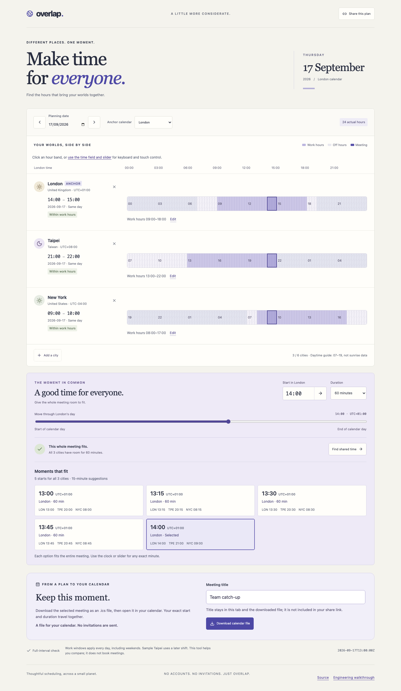

# Overlap

This is a recent AI-assisted portfolio demonstration with executable checks and documented limits; it is not evidence of prior production usage.

**Different places. One considerate meeting.**

Overlap is a time-zone planner built around actual instants, real daylight-saving transitions and whole-meeting working-hour checks. Move one meeting through a day and see what that moment means in London, Taipei, New York and eight other supported cities.



[Mobile view](docs/screenshots/mobile.png) · [Calendar handoff](docs/screenshots/calendar-export.png) · [Behavior specification](SPEC.md) · [Architecture](docs/ARCHITECTURE.md) · [Decision records](docs/DECISIONS.md)

**[Open the live demo](https://nen-io.github.io/overlap-planner/)** · [Three-minute engineering walkthrough](docs/REVIEWER_GUIDE.md) · [CI checks](https://github.com/nen-io/overlap-planner/actions)

## Run it

Node 24 and npm are required. No account, API key, backend or external assets.

```sh
npm ci
npm run dev
# Open http://127.0.0.1:4305
```

```sh
npm run typecheck       # Strict TypeScript checks
npm test                # Domain suite in the current host time zone
npm run test:tz         # Same suite in UTC, Los Angeles and Tokyo
npm run build           # Checked production bundle in dist/
npm run check           # Typecheck, all three host-TZ runs and build
npx playwright install chromium
npm run test:e2e        # Browser journeys and real screenshots
npm run format          # Format source, tests and docs
npm run format:check    # Verify formatting
```

## A quick walkthrough

1. Start with the sample team. Taipei has a later work shift; all hours are adjustable and synthetic.
2. Move the meeting slider with a pointer or arrow keys, or type an exact `HH:MM` start. Local dates, offsets, day shifts and entire-interval fit update together.
3. Compare **Moments that fit**: each shared-start card shows all city clocks, and selecting one preserves its exact instant. Change duration from 60 to 120 minutes; a start that fit before may no longer fit everyone.
4. Try **29 March 2026** anchored to London: the band contains 23 real hours and `01:30` is rejected. Try **25 October 2026**: the band contains 25 hours and `01:30` has two explicitly labelled UTC-offset choices.
5. Switch the anchor city. The chosen instant stays fixed while its displayed calendar date can change.
6. Use **Download calendar file** to hand the committed selection to your calendar. The .ics file contains UTC start/end instants, city-local times and your local-only title; it sends no invitations. Each download is a new standalone event, so importing repeatedly may create duplicates.
7. Share the URL. Configuration lives in its fragment, so reload restores the exact plan. Clipboard failure leaves a selectable link.

## Engineering worth exploring

- Pure, validated domain model with a curated IANA-zone catalog and Temporal instant/calendar types.
- A keyboard-stable minute slider and paginated shared starts with local clocks and explicit offsets.
- Actual 23/24/25-hour timelines. No assumption that a calendar day equals 86,400 seconds.
- Full meeting checks split at offset transitions and use an exclusive end boundary. An exact work-end is allowed.
- Explicit nonexistent/repeated-time policy, honest date-change fallback notices and anchor-switch instant preservation.
- One to six unique participants, bounded URL parsing, safe fallback and DOM text rendering.
- URL snapshots without accounts, uploads, analytics or localStorage; stale clipboard completions cannot mislabel a newer plan.
- RFC 5545 calendar export with exact UTC instants, byte-aware UTF-8 folding and no invite or booking side effects.
- Production CSP, readable architecture/security/scaling notes and tests under three different host time zones.

## Limits

The planner supports eleven curated cities, calendar dates from 2000 through 2099 and minute-precision meeting instants. Working windows use whole hours on the same local day, every day including weekends. Overnight shifts, holidays, calendar bookings and invitations are out of scope. The suggested shared-time search uses a 15-minute grid; the time field and slider allow every real minute.

Day/night shading is a **07:00–19:00 daytime guide**, not astronomical sunrise/sunset data. Future and historical zone behavior comes from the runtime's time-zone database through the polyfill; government rule changes require runtime updates. Share links contain settings and meeting times: they are not encrypted secrets.

[How it works](docs/ARCHITECTURE.md) · [Security](docs/SECURITY.md) · [Scalability](docs/SCALABILITY.md) · [Tests and evidence](docs/TESTING.md) · [Accessibility](docs/ACCESSIBILITY.md) · [Original assets](docs/ASSETS.md)

MIT licensed.
