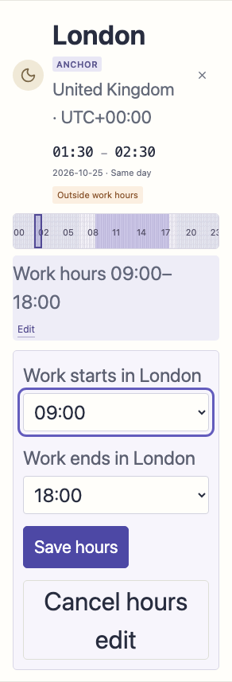

# Accessibility and human use

## Keyboard model

The first Tab stop is **Skip to meeting controls**. Enter focuses the labelled time field without changing the shared-plan URL fragment; Tab reaches Set meeting time and the duration controls. The native slider supports arrow keys at exact minute precision, including 23/25-hour days. Repeated local times offer explicitly labelled first/second UTC offsets; choosing one returns focus to the stable time field. Shared-start cards are normal buttons with selected state.

Hour-band cells remain pointer shortcuts outside the Tab sequence; adding 96 or 100 tiny stops per city would hinder navigation. A visible link explains the equivalent time-field/slider controls for keyboard and touch use. These controls cover every real minute, beyond the band's quarter-hour shortcuts.

Opening **Work hours in [city]** focuses its start selector. Save and Cancel return to that city's Edit button; Escape cancels from either selector. Invalid hours focus the end selector and associate both fields with the error. Opening Add a city focuses its selector; Cancel/Escape restores the trigger. If a shared-plan restoration fills the sixth slot while that form remains open, its trigger becomes disabled, so Cancel/Escape focuses the first city's heading instead; Tab then reaches that city's controls. Successful addition focuses the new city heading, and removal returns to Add a city. Invalid calendar titles return focus to their associated error field. Native controls retain their semantics and visible focus.

## Reproduced and corrected

The new browser tests initially failed because opening work hours and Add city did not move focus into the revealed forms. Inspection also identified unmounted Save/Remove/DST occurrence controls without a surviving focus destination. These transitions now use explicit refs; they do not modify the committed instant or silently apply an unfinished field. Main controls have at least 44px targets, essential work-hour text is at least 12px, and forced colors preserve focus/selection outlines. Reduced motion remains respected.

An independent production review also reproduced focus falling to the document body when cancelling an open add form after a six-city URL restoration. The regression test failed before adding the first-city fallback. It exercises both Cancel and Escape through the real `hashchange` handler, preserving the restored shared fragment and exact second-occurrence London meeting instant.

## Checked tasks and evidence

`tests/e2e/accessibility.spec.ts` covers keyboard open/save/cancel/Escape, hours error association, city add/remove, choosing the second repeated London 01:30, first-Tab skip-link navigation, calendar title validation, a representative 44px target, forced-colors/reduced-motion keyboard use and 320px layout with semantic text sizes doubled. Existing full suites retain DST, exact calendar file, URL restore, screenshot and text-scaling coverage. Current test totals are in [TESTING.md](TESTING.md).

## Limits and references

Automated Chromium checks and visually reviewed screenshots are evidence, not a claim of complete accessibility or WCAG conformance. Actual VoiceOver/NVDA/JAWS speech, native mobile screen readers, physical touch, switch/voice control, Safari/Firefox and all OS zoom/high-contrast combinations remain unverified. Forced-color emulation and doubled computed font sizes approximate selected conditions. No assistive-technology compatibility is inferred from axe results alone.

The implementation follows current [WAI focus-order guidance](https://www.w3.org/WAI/WCAG21/Understanding/focus-order), [form notification guidance](https://www.w3.org/WAI/tutorials/forms/notifications/), [target-size guidance](https://www.w3.org/WAI/WCAG22/Understanding/target-size-minimum.html) and [React DOM refs](https://react.dev/learn/manipulating-the-dom-with-refs), checked 23 September 2026. No dependencies, DST rules or calendar serialization changed.

## Additional production-engine check

The publishing review exercises one representative task and the skip destination in Playwright Chromium and WebKit at 1440, 720, 390 and 320px. Chromium additionally checks initial and task states with axe WCAG 2/2.1/2.2 A/AA rules and broad doubled-computed-text/forced-colors rendering. This is a scoped engine check, not the complete suite in Safari or a screen-reader session. On macOS, WebKit used Option-Tab to reach links; Safari's keyboard navigation setting determines ordinary Tab behavior. See [Apple's keyboard navigation guide](https://support.apple.com/guide/safari/cpsh003/mac).
