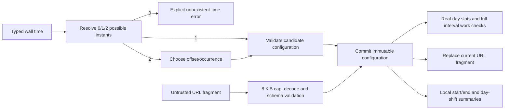

# Architecture

## The important distinction

An **instant** is one point on the global timeline. A **local date/time** is a wall-clock reading in a named zone; it can map to zero, one or two instants around a clock change. The model stores both an exact UTC meeting instant and its anchor's calendar date, and validation requires them to agree. Date-only strings become `Temporal.PlainDate`, never a host-local `Date`. All displayed clocks use 24-hour `HH:MM`.

## Module map

| Module                             | Responsibility                                                                                                                                       |
| ---------------------------------- | ---------------------------------------------------------------------------------------------------------------------------------------------------- |
| `src/domain/planner.ts`            | Curated cities, external-state validation, instant/calendar conversions, DST choices, date/anchor transitions, slot generation and full-interval fit |
| `src/domain/sharing.ts`            | Bounded fragment encoding/decoding, safe fallback and query-free share URLs                                                                          |
| `src/components/CityRow.tsx`       | City-local meeting summary, working band and hours draft form                                                                                        |
| `src/components/MeetingPicker.tsx` | Minute slider, typed time, repeated-time choices, duration and shared-slot suggestion                                                                |
| `src/App.tsx`                      | Committed configuration, safe actions, hash restoration, history replacement and guarded clipboard side effects                                      |
| `scripts/test-timezones.mjs`       | Cross-platform execution of the same domain suite under three host zones                                                                             |

## Concrete action: changing the anchor

The anchor select passes its supported zone into `changeAnchor`. That pure function keeps `meetingInstant` unchanged, converts that instant into the new zone and derives the new local calendar date. `validateConfiguration` checks the resulting date range, instant/date agreement, duration and participant bounds before state commits. If conversion crosses the supported calendar-year boundary, a safe action wrapper preserves the previous plan and shows an error.

React then derives start-of-day and next-day instants for the new anchor. Their elapsed difference is the actual day length. Slot generation steps along this instant interval in 15-minute increments, so missing wall times never appear and repeated times remain distinct. Each city converts those same instants into its own local clock. URL replacement records the new configuration without adding a history entry on every slider movement; reloading reconstructs the same instant/settings.

## DST policy

`possibleInstants` constructs both Temporal `earlier` and `later` interpretations, then compares their actual plain date/time to the requested wall reading. Zero exact matches means a gap and is rejected. Two unique matches mean a repeated time and require a visible occurrence choice with UTC offset. One match is unambiguous.

Date navigation preserves the desired anchor wall time where possible. In a gap, it scans the bounded actual day to the first existing minute at or after that wall time and announces the fallback. In a repeat, it selects the earlier occurrence and says so; the user can then select the other. Anchor changes follow a different rule: they always preserve the instant.

The ruler and bands represent actual instants, while repeated-hour chips and the time field distinguish UTC offsets. Meeting markers are clipped at the displayed day edge when the meeting continues into the next day; textual summaries retain the full end time/day shift. Suggested shared starts come from the 15-minute grid, while manual selection has one-minute precision.

## Whole-interval working hours

A work window is an integer-hour range within one local calendar date, such as 09:00–18:00 or 00:00–24:00. `fullIntervalFits` partitions the meeting at actual zone-offset transitions using `getTimeZoneTransition`. Wall time is monotonic inside each segment. It checks the segment's first instant and the instant one nanosecond before its exclusive end against the work window and the original local date. This allows a meeting ending exactly at work end or midnight, rejects any overrun, and avoids endpoint-only assumptions around clock changes.

Work-band coloring describes working instants independently of meeting duration. The availability check and shared-time suggestion use the complete selected duration. The daytime background is explicitly a conventional 07–19 guide, not a solar calculation.

## Sharing and asynchronous behavior

The fragment contains a JSON configuration encoded as a URI component. Both encoded and decoded input are bounded to 8 KiB, and validation rejects unsupported versions, zones, dates, durations, duplicates and invalid work windows. Malformed links load a deterministic safe sample with a warning; untrusted strings are not echoed into HTML.

The URL holds settings only. No localStorage, cookies, backend or remote API is used. Query parameters are removed from generated share URLs to avoid accidentally copying unrelated query data. A clipboard operation captures one immutable link snapshot and a generation number; a later edit or newer copy invalidates stale completion notices. Clipboard denial offers the visible link for manual copy. URL-fragment changes are validated as external input too.

## Library choice and official sources

Consulted 17 September 2026. `@js-temporal/polyfill` version 0.5.1 is pinned with a lockfile and imported explicitly for consistent APIs across runtimes. Native Temporal support is not assumed. It still relies on the host's Intl/time-zone database; the package does not freeze government time-zone rules.

- [TC39 Temporal time-zone guide](https://tc39.es/proposal-temporal/docs/timezone.html): exact versus wall time and gap/repeat disambiguation.
- [TC39 ZonedDateTime reference](https://tc39.es/proposal-temporal/docs/zoneddatetime.html): explicit disambiguation and offset transitions.
- [Temporal polyfill releases](https://github.com/js-temporal/temporal-polyfill/releases): maintained release and version selection.
- [Temporal polyfill repository](https://github.com/js-temporal/temporal-polyfill): package scope and Intl/runtime behavior.
- [React useMemo](https://react.dev/reference/react/useMemo): derived slot calculations depend on date, zone, duration and participant windows, not the moving instant.
- [Vite static deployment](https://vite.dev/guide/static-deploy): relative `base` supports a GitHub repository subpath.

## Stable selection and shared-start presentation

`components/SharedStarts.tsx` filters the already derived `Slot[]` by `allWorking` and paginates six choices. It does not implement a second overlap calculation. Selection sends that slot's exact instant through the existing validated configuration update. Each card converts that same instant through Temporal for local clocks and day shifts; repeated anchor clocks include their UTC offset.

The meeting picker no longer uses the instant as a React key. An effect resets only clock draft, validation error, and occurrence choices when the committed instant/calendar or explicit URL-restore generation changes. The existing slider node keeps focus across keyboard minute changes. City-row keys include that UI restore generation so a form opened for an older shared plan cannot overwrite the new plan with its draft.

Refinement sources checked against official documentation on 17 September 2026: [React state identity](https://react.dev/learn/preserving-and-resetting-state), [React DOM refs](https://react.dev/learn/manipulating-the-dom-with-refs), [Playwright focus/value assertions](https://playwright.dev/docs/test-assertions), and [Temporal ZonedDateTime](https://tc39.es/proposal-temporal/docs/zoneddatetime.html). Dependency versions were retained.
