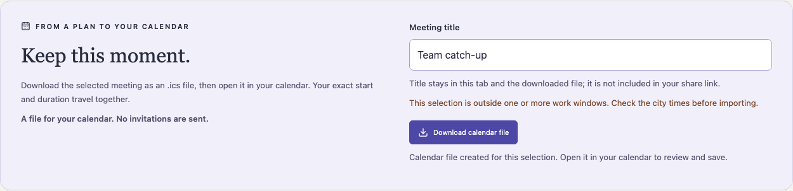

# Overlap in three minutes

[Open the demonstration](https://nen-io.github.io/overlap-planner/) · [Source](https://github.com/nen-io/overlap-planner)

This is a recent AI-assisted portfolio demonstration. City work windows are synthetic planning preferences; there is no connected calendar, availability feed or booking service.

## 0:00 — Move one real instant

Change the meeting duration, select a card under **Moments that fit**, then move the minute slider with the keyboard. Each city clock and full-interval fit updates together. Change the anchor calendar: the same instant is retained even when the displayed date changes.

## 1:00 — Try the difficult day

Choose **25 October 2026**, anchor London, then type **01:30**. Choose the second occurrence, labelled UTC+00:00. Under **Keep this moment**, download a calendar file. Its `DTSTART:20261025T013000Z` encodes that exact occurrence; the first occurrence would be `20261025T003000Z`. `DTEND` adds real elapsed minutes, including across DST changes. The download is a standalone event, not an invitation. Importing repeated downloads can create duplicate events.



## 2:00 — Follow the model and evidence

- [Planner](../src/domain/planner.ts): distinct instant/calendar types, gap/repeat policy and full-interval work checks.
- [Calendar serializer](../src/domain/calendar.ts): strict configuration validation, UTC timestamps, escaped text and UTF-8 byte-aware folding.
- [Sharing](../src/domain/sharing.ts): bounded URL snapshots; the event title is intentionally excluded.
- [Domain tests](../tests/unit/calendar.test.ts): both repeated instants, spring transition, year boundary, hostile title and long Unicode lines.
- [Browser tests](../tests/e2e/calendar.spec.ts): inspect actual downloaded bytes and preserve uncommitted time drafts.

```sh
npm ci
npm run check
npx playwright install chromium
npm run test:e2e
```

The check command repeats the domain suite under UTC, Los Angeles and Tokyo host time zones. Those are repeated executions of the same cases, not extra distinct tests.

## Boundary worth discussing

Work windows apply every day and are not personal calendar availability. Supported cities, dates, participants and durations are bounded. Calendar export adds no backend or invitations: no ATTENDEE, ORGANIZER, alarm, recurrence or scheduling METHOD is emitted. It exports the committed plan, even if a time-field draft has not been applied. Future local-time rules still depend on the runtime time-zone database; an exported UTC snapshot intentionally keeps its already-chosen instant. See [decisions](DECISIONS.md), [security](SECURITY.md) and [scalability](SCALABILITY.md).
